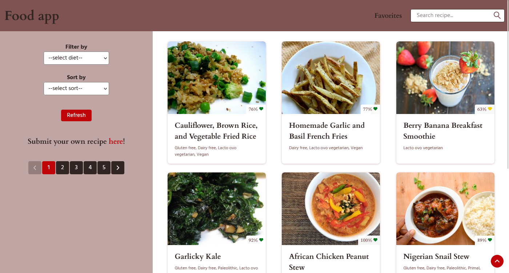
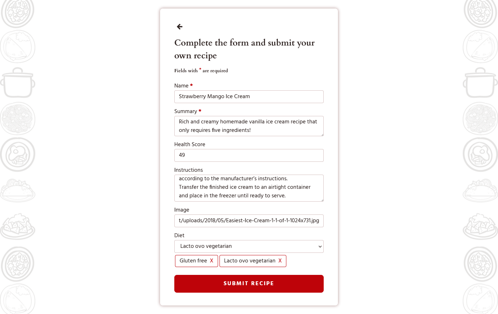
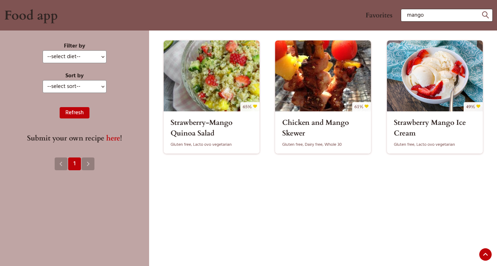
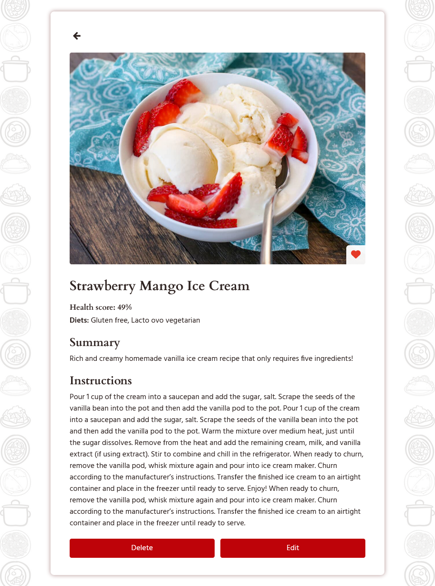
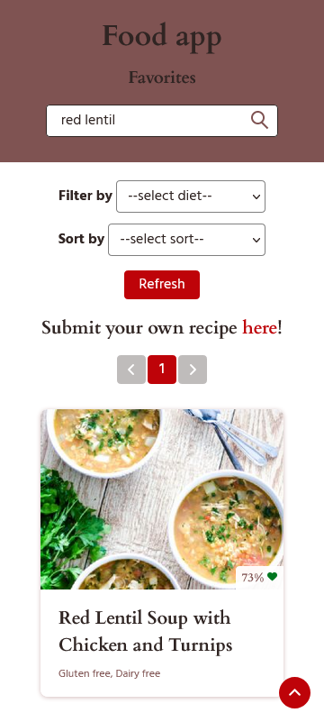

# Individual Project - Henry Food

## Objetivos
- Construir una App utlizando React, Redux, Node y Sequelize.
- Afirmar y conectar los conceptos aprendidos en la carrera.
- Aprender mejores prácticas.
- Aprender y practicar el workflow de GIT.
- Usar y practicar testing.

## Proyecto
El proyecto es una aplicación FullStack en la cual se puede visualizar alrededor de 100 recetas. La aplicación le permite al usuario filtrar por tipo de dieta, realizar diversos ordenamientos y agregar recetas a favoritos. Además, puede buscar por nombre o puntaje de salud, crear una nueva y editar o borrar una ya creada. El diseño también es responsive!
Esta aplicación fue desarrollada como proyecto individual en el Bootcamp de [soyHenry](https://www.soyhenry.com/).

## Tecnologías
El FrontEnd de la aplicación se encuentra desarrollado con React.js, Redux y CSS.

El BackEnd se encuentra desarrollado con NodeJS, Express y PostgreSQL.

## Funciones
- Visualizar +100 recetas.
- Acceder a los detalles de cada una.
- Buscar, filtrar y ordenar.
- Agregar a favoritos.
- Visualizar por página.
- Crear una nueva receta.
- Editar la receta creada.
- Eliminar la receta creada.

## Screenshots

